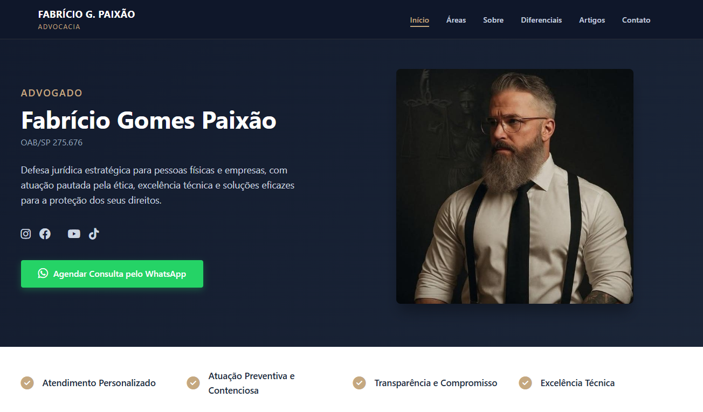

# Fabrício Gomes Paixão — Advocacia

Site institucional do advogado **Fabrício Gomes Paixão** (OAB/SP 275.676), desenvolvido com HTML, CSS e JavaScript puros, hospedado na Vercel.

🔗 **[fgp-adv.vercel.app](https://fgp-adv.vercel.app)**

---



---

## ⚖️ Sobre o Projeto

Landing page profissional para advocacia com foco em conversão e credibilidade. Design dark premium com tipografia elegante, seções estratégicas e call-to-action direto para WhatsApp.

### Seções
- **Hero** — Apresentação com foto profissional e CTA para WhatsApp
- **Áreas de Atuação** — Direito Civil, Criminal, Militar, Trabalhista e Empresarial
- **Sobre** — Trajetória e formação do advogado
- **Diferenciais** — Pilares de atuação
- **Artigos** — Publicações jurídicas
- **Contato** — Formulário e informações de contato

---

## 🛠️ Tecnologias

- **HTML5** — Semântico e acessível
- **CSS3** — Design responsivo, variáveis CSS, animações
- **JavaScript** — Navbar dinâmica, scroll suave, interações
- **Vercel** — Deploy contínuo via GitHub

---

## 📂 Estrutura

```text
fgp-adv/
├── index.html
├── css/
│   └── style.css
├── js/
│   └── main.js
├── images/
│   └── ...
└── README.md
```

---

## 🚀 Deploy

O site está em produção na Vercel com deploy automático a cada push na branch `main`.

```bash
# Desenvolvimento local
git clone https://github.com/Adinan001/fgp-adv.git
cd fgp-adv
# Abra index.html no navegador
```

---

## ✨ Características

- Design dark premium com paleta dourada
- 100% responsivo (mobile, tablet, desktop)
- SEO otimizado (meta tags, Open Graph, canonical)
- Acessibilidade (ARIA labels, navegação por teclado)
- Performance otimizada (sem frameworks, carregamento rápido)
- CTA integrado com WhatsApp

---

## 📄 Licença

Este projeto está sob licença MIT.

Desenvolvido por **[Adinan Lima — MMG Soluções](https://github.com/Adinan001)**
